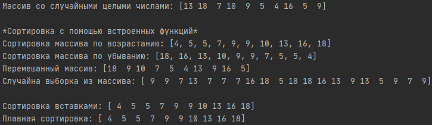
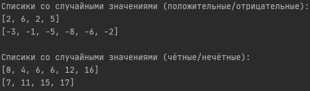
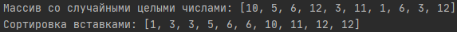

# Содержание
- [ИСР № 4](#инвариативная-самостоятельная-работа--4)
    - [1 задание]
    - [2 задание]
- [ВСР № 4](#вариативная-самостоятельная-работа--4)

# Инвариативная самостоятельная работа № 4
### [4.1. ](https://repl.it/@Rakleed/programming4-indepworkinvar4-1)
```python

```


### [4.2. ](https://repl.it/@Rakleed/programming4-indepworkinvar4-2)
```python

```


# [Вариативная самостоятельная работа № 4](https://repl.it/@Rakleed/programming4-indepworkvar4)
```python

```

